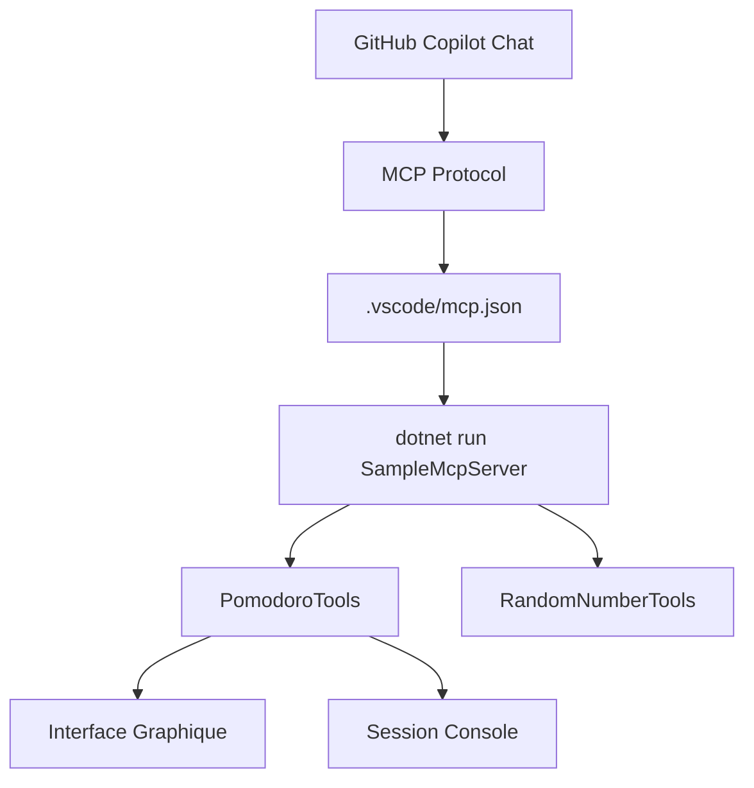

# 🎉 Configuration MCP GitHub Copilot Terminée !

## ✅ Ce qui a été configuré

### 1. Fichier de configuration MCP
- **Créé** : `.vscode/mcp.json`
- **Contenu** : Configuration du serveur MCP POC-MCP-Server
- **Chemin** : `src/SampleMcpServer`
- **Transport** : stdio (JSON-RPC via stdin/stdout)

### 2. Documentation mise à jour
- **README principal** : Ajout de section GitHub Copilot avec exemples
- **Documentation MCP** : `docs/github-copilot-mcp.md` avec guide complet
- **README serveur** : Exemples d'outils Pomodoro documentés

### 3. Script de validation
- **Créé** : `scripts/test-mcp-config.sh`
- **Fonction** : Valide la configuration MCP
- **Tests** : Compilation, démarrage serveur, structure fichiers

## 🚀 Utilisation

### Démarrage automatique
Quand vous ouvrez ce projet dans VS Code avec GitHub Copilot :
1. VS Code détecte automatiquement `.vscode/mcp.json`
2. Le serveur MCP se lance en arrière-plan quand nécessaire
3. GitHub Copilot peut invoquer les outils MCP

### Commandes disponibles
Demandez à GitHub Copilot :

#### 🍅 Outils Pomodoro
- `"Lance un Pomodoro avec interface graphique"`
- `"Démarre une session de 30 minutes en français"`
- `"Arrête ma session Pomodoro"`
- `"Quel est le statut de mon timer ?"`

#### 🎲 Outils utilitaires
- `"Donne-moi 3 nombres aléatoires"`
- `"Génère des nombres entre 10 et 100"`

### Outils MCP exposés
1. `start_pomodoro_console` - Session Pomodoro console
2. `start_pomodoro_graphical` - 🆕 Interface graphique Pomodoro
3. `stop_pomodoro_session` - Arrêt de session
4. `get_pomodoro_status` - Statut actuel
5. `get_available_languages` - Langues disponibles
6. `get_random_number` - Génération de nombres aléatoires

## 🔧 Architecture technique

## 📁 Fichiers ajoutés/modifiés

### Nouveaux fichiers
- `.vscode/mcp.json` - Configuration MCP
- `docs/github-copilot-mcp.md` - Documentation complète
- `scripts/test-mcp-config.sh` - Script de validation
- `POMODORO_UI_MCP_TOOL.md` - Documentation outil graphique

### Fichiers modifiés
- `README.md` - Section GitHub Copilot ajoutée
- `src/SampleMcpServer/README.md` - Outils Pomodoro documentés
- `src/SampleMcpServer/Tools/PomodoroTools.cs` - Outil graphique ajouté

## ✨ Prêt à utiliser !

Le serveur MCP est maintenant entièrement intégré à GitHub Copilot pour ce projet. 

**Testez maintenant** :
1. Ouvrez ce projet dans VS Code
2. Ouvrez GitHub Copilot Chat 
3. Tapez : *"Lance un Pomodoro avec interface graphique"*
4. Regardez la magie opérer ! 🪄

---

🎊 **MCP + GitHub Copilot + Pomodoro Timer = Productivité maximale !**